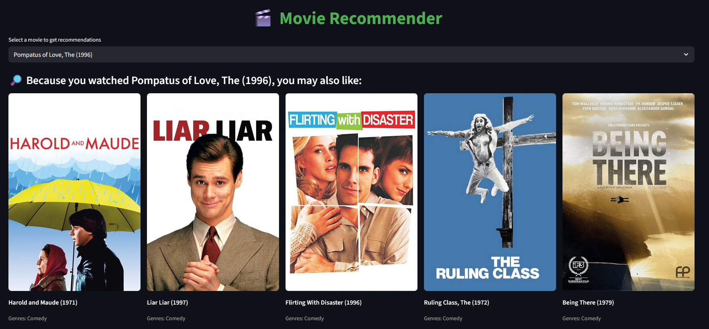

# 🎬 Movie Recommender System (Streamlit + ML)

A hybrid movie recommender system (Content-Based + Collaborative Filtering) built using Python, Streamlit, Scikit-learn, and interactive visualizations. Ideal for learning data science workflows: EDA → Modeling → Deployment.

---

## 📸 App Preview



---

## 📁 Project Structure

```bash
movie-recommender/
├── app/ # Streamlit app logic
│ ├── init.py # Init file for app package
│ ├── main.py # Streamlit UI code
│ ├── recommender.py # Recommendation logic (CBF + CF)
│ ├── retrain_models.py # Script to retrain or update models
│ └── utils.py # Data loaders, preprocessors, utilities
│
├── data/
│ ├── raw/ # Original datasets (u.data, u.item)
│ └── processed/ # Cleaned and merged dataset ( movies.csv)
│
├── models/ # Trained ML models and vectorizers
│ ├── knn_model.pkl
│ ├── nn_model.pkl
│ ├── nn_tfidf_model.pkl
│ ├── svd_model.pkl
│ ├── tfidf_vectorizer.pkl
│ └── tfidf.pkl
│
├── notebooks/ # EDA and modeling notebooks
│ ├── 01_eda.ipynb
│ ├── 02_modeling.ipynb
│ └── csv.ipynb
│
├── outputs/ # Visualizations and charts
│ ├── genre_heatmap.png
│ ├── ratings_distribution.png
│ ├── top_20_highest_rated.png
│ ├── top_20_most_rated.png
│ └── wordcloud_titles.png
│
├── screenshots/ # App interface screenshots (for README/docs)
│ ├── image1.png
│ └── image2.png
│
├── .env # Environment variables (not pushed)
├── .gitignore # Git ignore rules
├── requirements.txt # Python dependencies
└── README.md # Project documentation
```

---

## 🚀 Features

- ✅ Streamlit-based interactive UI
- ✅ Hybrid recommender (CB + CF)
- ✅ Model trained using TF-IDF + KNN
- ✅ Clean architecture and modular codebase
- ✅ Exploratory Data Analysis and modeling notebooks

---

## 🔧 Setup Instructions

```bash
# Clone the repo
git clone https://github.com/loutou-anas/movie-recommender.git
cd movie-recommender

# Create a virtual environment
python -m venv venv
source venv/bin/activate  # or venv\Scripts\activate on Windows

# Install dependencies
pip install -r requirements.txt

# Run the app
streamlit run app/main.py
```

---

## 📊 Data Source

MovieLens 100K dataset (GroupLens):
📥 https://grouplens.org/datasets/movielens/100k/

---

## 🛡️ Security

This project uses a .env file to store sensitive variables like API keys. Make sure .env is never committed (it's ignored in .gitignore).

---

## 📘 License

MIT License. Feel free to use, share, and improve.

## 👨‍💻 Author

Anas Loutou • anasloutou20@gmail.com

LinkedIn: https://www.linkedin.com/in/anas-loutou/